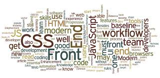

<h1 align="center">Hello , I am 
    Sumit Maurya
</h1>

<h3 align="center">A passionate frontend developer</h3>

    

---

### About Me
 

- I’m currently working on improving my frontend skills and building interactive websites  

- I’m learning <strong>React</strong> and <strong>Node.js</strong>

- Ask me about <strong>HTML</strong>, <strong>CSS</strong>, <strong>JavaScript</strong>, or anything frontend!

- Fun fact: I love to deep dive into <strong>JavaScript</strong> and modern web technologies.

---

### Connect with me

  <a href="https://codepen.io/codingmation" target="blank">
    <strong> CodePen.io</strong></a>
 
 
  <a href="https://linkedin.com/in/codingmation" target="_blank">
    <strong> LinkeDin</strong>
  </a>

---

<h3 align="left">Languages and Tools:</h3>
 

 
 

 ---
