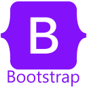

<h1 align="center">👋 Hey there, I'm Sumit Maurya</h1>

<h3 align="center">🚀 A Passionate Full Stack (MERN) Developer from India</h3>

  

---

## 💫 About Me

- 🌱 Currently sharpening my **Full Stack Development (MERN)** skills
- 💡 Learning **DSA in Java**
- ⚡ Fun fact: I love exploring **modern web technologies** & diving deep into **JavaScript**

---

## 🌐 Connect with Me

  <a href="https://codepen.io/codingmation" target="_blank">
     <b>CodePen</b>
  </a> &nbsp;&nbsp;
  <a href="https://linkedin.com/in/codingmation" target="_blank">
     <b>LinkedIn</b>
  </a>

---

## 💻 Tech Stack

### 🌐 Frontend

  
  
  
  
  
  
  
  

### ⚙️ Backend

  
  
  
  
  
  

### 🗄️ Database

  
  

---

## 📊 GitHub Stats

 
 

 

---

## 🔥 GitHub Activity Graph

  

